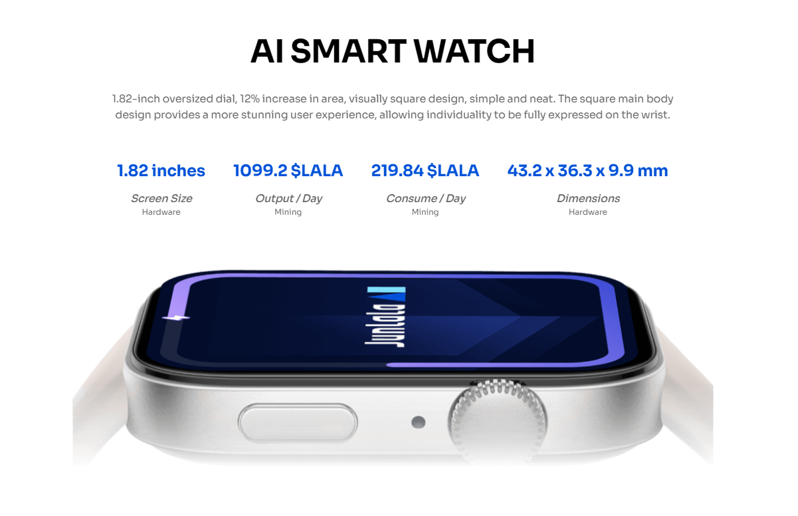

# AI Watch

AI Watch is JUNLALA’s flagship AI hardware device and a key component of its AI+DePIN business model. As the first AI smart hardware device launched within the Ethereum ecosystem, AI Watch serves as both a Genesis computing power node and a crucial tool for users to participate in decentralized computing power mining.

<figure><figcaption>
JUNLALA AI Smart Watch
</figcaption></figure>
