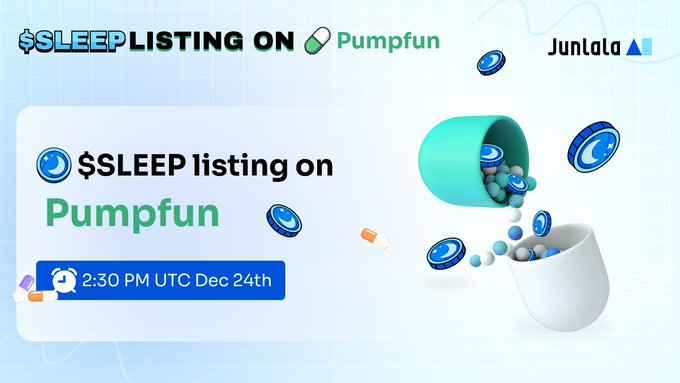

# AI Watch

**AI Watch: Empowering DeSci Innovation**\
JUNLALA’s AI Watch is a game-changer for decentralized science (DeSci), enabling secure and real-time health data collection while empowering users to contribute to groundbreaking research. Its robust design ensures reliability, while integration with blockchain technology provides users with token rewards proportional to the value of their data. Beyond its scientific impact, AI Watch unlocks additional incentives, including exclusive token rewards and meme coin airdrops, redefining the synergy between AI and decentralized science.

<figure><figcaption>
AI Smart Watch
</figcaption></figure>
