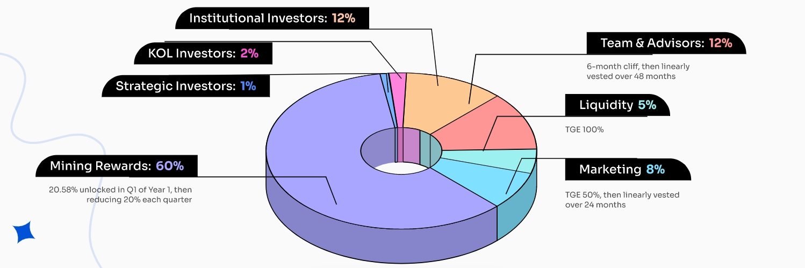

# $LALA Tokenomics

The total supply of $LALA is 2 billion, with the distribution designed to incentivize the long-term sustainability of the ecosystem:

<figure><figcaption>
$LALA Tokenomics
</figcaption></figure>
