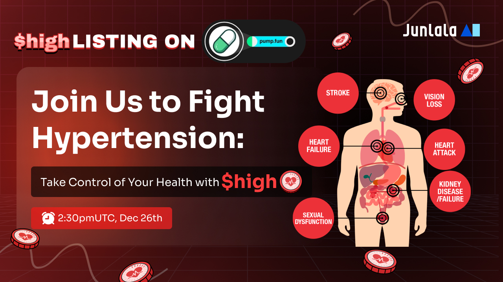

# $high(Biohigh)

**$high: DeSci Meme for Combating Hypertension**The DeSci meme $high is an innovative token from JunLaLa Research Guilds, designed to drive cutting-edge research on hypertension prevention and management, and to increase public awareness of hypertension and related conditions. Utilizing comprehensive health and wellness data collected from the JunLaLa AIWatch and App, $high empowers the development of personalized strategies to address early signs of high blood pressure, improving long-term cardiovascular health and quality of life.

The hypertension research project aims to create a healthier future by promoting awareness, early intervention, and preventive care for hypertension. $high tokens fuel this mission by supporting research, incentivizing early adoption, and rewarding active engagement in combating hypertension and its related conditions.

<figure><figcaption></figcaption></figure>

Contract address: TBD

* Check post:  [https://x.com/JunLaLaltd/status/1872207954881188295](https://x.com/JunLaLaltd/status/1872207954881188295)
* Listing on Pumpfun:TBA
* Dexsreener:TBA
* Dextools:TBA
